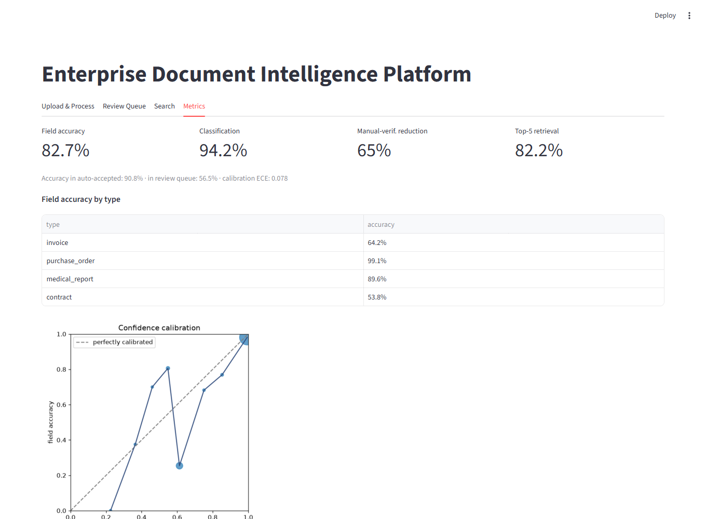
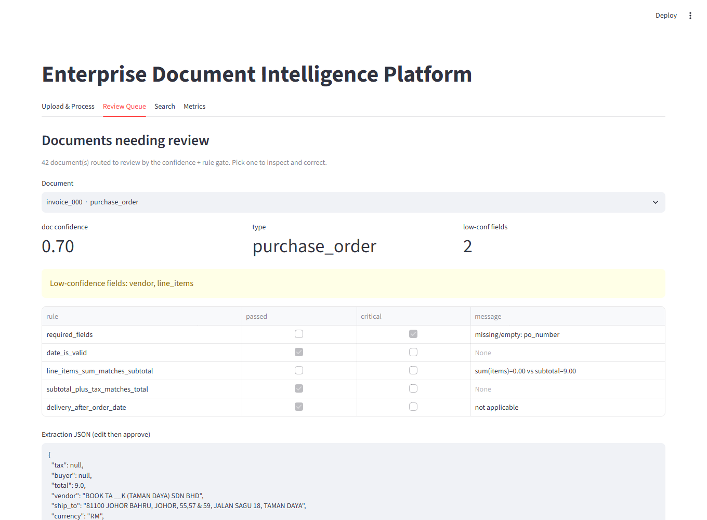
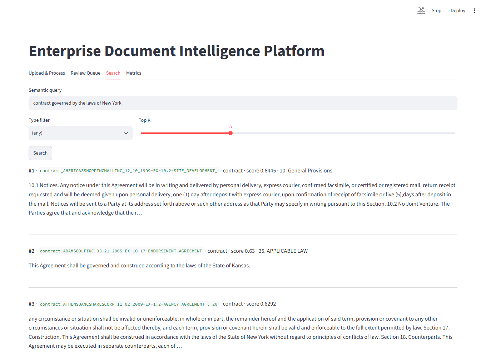

# Enterprise Document Intelligence Platform

Configurable AI pipeline for intelligent document processing — ingestion, classification,
schema-driven extraction, hybrid validation with confidence scoring and human review, and
semantic retrieval — across **invoices, purchase orders, medical reports, and contracts**.

**Stack:** Python · FastAPI · LangGraph · Qwen2.5‑3B (Ollama) · Docling · BAAI BGE‑M3 · Qdrant · PostgreSQL · Docker · Streamlit

## Results (120-doc eval, Qwen2.5-3B via Ollama)

| Metric | Value |
|---|---|
| **Field-level extraction accuracy** | **82.7%** overall — purchase_order 99%, medical_report 90%, invoice 64% (noisy receipt OCR), contract 54% (long-doc, `field_by_field`) |
| Document classification accuracy | 94.2% |
| **Manual-verification reduction** | **65%** of documents auto-accepted; accuracy within the auto-accepted set 90.8% vs 56.5% in the human-review queue |
| Confidence calibration (ECE) | 0.078 — token log-probability aggregation, see `artifacts/calibration.png` |
| **Semantic retrieval — recall@5** | **82.2%** (MRR@5 0.61) over 844 indexed chunks / 157 graded queries |
| Mean pipeline latency (T4 GPU) | 10 s/doc |

Regenerate with `scripts/eval_extraction.py` + `scripts/eval_retrieval.py` (see [Evaluation](#evaluation)).

## The app

| Metrics dashboard | Human-review queue |
|---|---|
|  |  |

| Semantic search | |
|---|---|
|  | The **Review Queue** shows every field's log-probability confidence, the rule-check outcomes, and an editable extraction that re-indexes on approval. |

Sample documents to try in the **Upload & Process** tab live in [`test_samples/`](test_samples/)
(one per type; `python scripts/shoot_screenshots.py` regenerates the images above from a running app).

---

## Architecture

```
Streamlit UI ──HTTP──> FastAPI ──> LangGraph pipeline (per-document StateGraph)
                          │
   ingest → parse(Docling) → classify(Qwen) → extract(Qwen + JSON schema) → validate → route
                                                                                │
                                       ┌────────────────────────────────────────┴───────────┐
                                  auto_accept                                          needs_review
                              (no critical rule fails                              (Streamlit review queue:
                               ∧ doc_conf ≥ τ_doc                                   edit fields → re-validate
                               ∧ ≤1 field < τ_field)                                → re-index)
                                       │                                                    │
                                       ▼                                                    ▼
                       chunk → BGE-M3 embed → Qdrant  <──────────────── semantic search / retrieval eval

PostgreSQL: documents · extractions · field_confidences · validation_results · review_queue · audit_log
```

Confidence is **token log‑probability aggregation**: for each schema field the value span in the
generated JSON is mapped back to its output tokens and scored by `min`/`mean` of `exp(logprob)`
(fallback: self‑consistency across resamples). This feeds both the auto‑accept gate and a
calibration curve.

## Configurable by design

Adding a document type = **one YAML + one Pydantic model**, no pipeline code:

- `config/doc_types/<type>.yaml` — schema ref, classifier hint, extraction strategy, validation
  rules, confidence thresholds, chunking params
- `src/dip/schemas/<type>.py` — the `ExtractionBase` subclass (drives JSON‑schema prompting + coercion)
- `config/pipeline.yaml` — global LLM / embedding / Qdrant / threshold defaults

## Datasets (120 documents, 30 per type)

| Type | Source | Ground truth |
|---|---|---|
| Invoice | [SROIE](https://github.com/zzzDavid/ICDAR-2019-SROIE) receipt images | `company, date, address, total` |
| Contract | [CUAD v1](https://www.atticusprojectai.org/cuad) contracts | `parties, dates, governing_law, renewal_term, …` (master_clauses.csv) |
| Purchase order | synthetic (`scripts/gen_synthetic.py`) | exact generation params |
| Medical report | synthetic radiology/lab templates | exact generation params |

```bash
python scripts/fetch_data.py --invoices 30 --contracts 30
python scripts/gen_synthetic.py --purchase-orders 30 --medical 30 --seed 7
python scripts/prepare_eval.py            # -> data/eval/manifest.jsonl
```

## Quickstart (laptop demo)

```bash
# 0. infra
docker compose up -d postgres qdrant

# 1. env (Python 3.11 — Docling/torch have no 3.14 wheels)
uv venv --python 3.11 && uv pip install -r requirements-ml.txt && uv pip install -e . --no-deps
cp .env.example .env

# 2. LLM backend — local Ollama
ollama pull qwen2.5:3b-instruct-q4_K_M      # ollama serve runs as a service

# 3. sanity
python scripts/check_env.py                 # config + DB + Qdrant + LLM/logprobs

# 4. bring up the app
uvicorn dip.api.main:app --reload --port 8000
streamlit run src/dip/ui/app.py             # http://localhost:8501
```

Upload a document in the UI → watch classify → extract → validate → route. Low‑confidence
extractions land in **Review Queue**; approving one re‑indexes it.

## Evaluation

The 120‑doc extraction pass is LLM‑bound and slow on CPU (~2 min/doc). Run it on a **Colab
T4 GPU** with `notebooks/colab_runner.ipynb` (Ollama on GPU = same model, ~10× faster),
then bring the artifacts back:

```bash
# on Colab (notebook does this):
bash scripts/colab_bootstrap.sh
WORKERS=6 bash scripts/run_all_eval.sh       # -> artifacts_bundle.zip

# on the laptop, after unzipping into ./artifacts:
cp artifacts/parsed_cache/* data/cache/ 2>/dev/null
python scripts/build_index.py --recreate     # re-embed 120 docs into local Qdrant (~10 min CPU)
python scripts/eval_extraction.py            # regenerates metrics.json / eval_report.md / calibration.png
python scripts/eval_retrieval.py --k 5
python scripts/load_results_to_db.py         # populate Postgres so the review queue is live
```

Metrics produced (`artifacts/metrics.json`, `eval_report.md`):

- **field‑level extraction accuracy** — normalised match vs ground truth, overall / per type / per field
- **manual‑verification reduction** — auto‑accept rate, with accuracy inside vs outside the auto‑accepted set
- **Top‑5 retrieval accuracy** — recall@5 / MRR@5 over `data/eval/retrieval_queries.jsonl`
- **confidence calibration** — ECE + `calibration.png`

## Layout

```
config/          pipeline.yaml + doc_types/*.yaml + examples/*.json
src/dip/
  config.py      env settings + YAML config loaders
  schemas/       Pydantic extraction schemas (one per doc type)
  parsing/       Docling parser (+cache) and structure-aware chunker
  llm/           OpenAI-compatible client (logprob capture) + schema-driven extraction
  validation/    business rules + log-probability confidence scoring
  pipeline/      LangGraph state, nodes, graph, classifier
  retrieval/     BGE-M3 embeddings, Qdrant store, search, single-doc indexing
  db/            SQLAlchemy models, session, state persistence
  api/           FastAPI app
  ui/            Streamlit app
scripts/         data prep, batch runner, index builder, eval, Colab bootstrap
notebooks/       colab_runner.ipynb
```

## Notes / limitations

- Qwen2.5‑3B is weakest on long contracts; `contract.yaml` uses a `field_by_field` strategy hook
  and a larger text budget. Numbers are honest 3B/Ollama figures.
- `docker compose --profile app up` runs FastAPI + Streamlit in containers too (large image — pulls
  torch via Docling); the default flow runs them on the host.
- Human‑in‑the‑loop is a status‑flag + edit/re‑index flow, not a LangGraph checkpointer resume.
